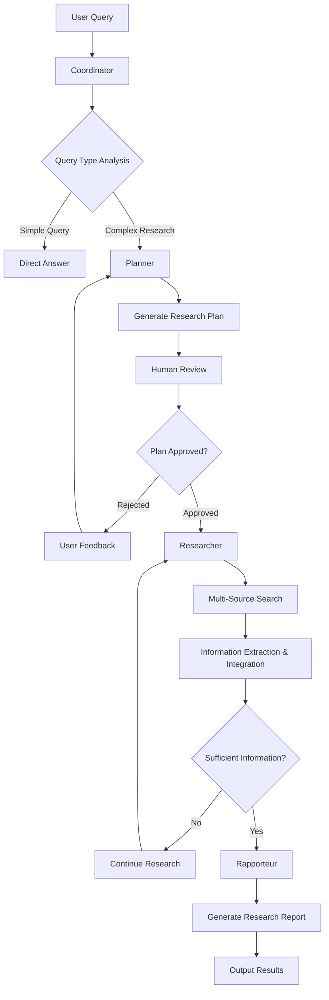

# 🤖 PDA - Intelligent Research Assistant

<div align="center">


**Multi-Agent Collaborative Automated Research Platform**

</div>

---

## 📋 Project Overview

PDA (Personal Digital Assistant) is an intelligent research assistant that automatically decomposes complex research tasks, executes multi-source information retrieval, and generates structured research reports using a multi-agent collaboration system built on LangGraph workflow engine.

### 🎯 Core Capabilities

- **Intelligent Task Decomposition**: Automatically break down complex research problems into executable subtasks
- **Multi-Source Information Retrieval**: Integrate multiple data sources including Tavily, arXiv, MCP
- **Dynamic Workflow**: Flexible execution flow based on conditional routing
- **Human-Machine Collaboration**: Support interactive research with human review and feedback
- **State Persistence**: Support interrupt recovery and long-term research tasks

---

## 🏗️ System Architecture

### Multi-Agent Architecture

PDA employs a sophisticated multi-agent architecture with four specialized agents:

| Agent | Responsibility | Core Functions |
|-------|---------------|----------------|
| **Coordinator** | Central Orchestrator | Intent analysis, query classification, process control |
| **Planner** | Research Strategist | Task decomposition, plan generation, iterative optimization |
| **Researcher** | Information Gatherer | Information retrieval, content extraction, result integration |
| **Rapporteur** | Report Generator | Information organization, analysis synthesis, report generation |

### System Architecture Diagram



### Core Components

```
PDA/
├── agents/           # Agent modules
├── workflow/         # LangGraph workflow engine
├── llm/              # Language model integration
├── tools/            # External tool integration
├── prompts/          # Prompt templates
└── utils/            # Utility modules
```

---

## 🔄 Interaction Flow

### Research Process Interaction

**Phase 1: Query Analysis**
- User submits research query
- Coordinator analyzes query complexity
- Routes to appropriate execution path

**Phase 2: Research Planning**
- Planner generates structured research plan
- Breaks down into subtasks with priorities
- Specifies data sources and completion criteria

**Phase 3: Human Review (Optional)**
- System pauses for plan review
- User can approve, reject with feedback, or cancel
- Automated mode bypasses this step

**Phase 4: Information Retrieval**
- Researcher executes approved plan
- Performs multi-source searches
- Extracts and integrates relevant information
- Tracks progress and iterations

**Phase 5: Report Generation**
- Rapporteur synthesizes collected information
- Generates structured reports in multiple formats
- Includes proper citations and references

### Interaction Modes

**Interactive Mode**
- Human oversight at critical decision points
- Plan review and approval process
- Real-time progress monitoring
- User feedback integration

**Automated Mode**
- Fully automated execution
- Automatic plan approval
- Hands-off operation
- Ideal for batch processing

### State Management

The system maintains comprehensive state throughout the research process:
- Research query and user feedback
- Generated research plans and approval status
- Search results and extracted information
- Iteration counts and completion status
- Report generation progress

This state persistence enables interrupt recovery and iterative plan refinement.

---

## 🚀 Quick Start

### Requirements
- Python 3.8+
- At least one LLM API key (DeepSeek/OpenAI/Claude/Gemini)

### Installation
1. Clone the project and navigate to directory
2. Install dependencies using pip
3. Configure environment variables with API keys
4. Run the research assistant with your query

The system supports both interactive mode (with human review) and fully automated mode.

---

## 📄 License

This project is a reproduction implementation based on [SDYJ_Multi_Agents](https://github.com/hwfengcs/SDYJ_Multi_Agents). The original project is open-sourced under the MIT License. Since the original project did not explicitly specify copyright information, this repository has supplemented the complete MIT license text (see [LICENSE](LICENSE) file). If the original author finds any copyright information errors, please feel free to contact for corrections.

This project is open-sourced under the MIT License. See the [LICENSE](LICENSE) file for details.

